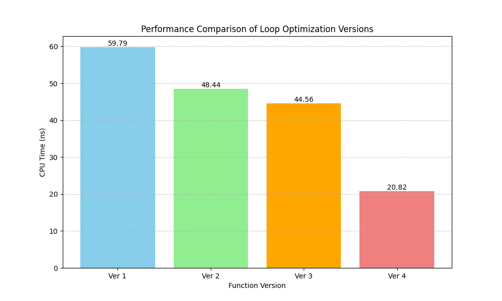

```bash
FUNC=4 just
FUNC=4 just disasm
```

## Performance Comparison
To generate a bar graph comparing the performance of all 4 `Func` versions, you can use the `plot_performance.py` script.

1.  **Create a Python virtual environment:**
    ```bash
    python3 -m venv .venv
    ```

2.  **Activate the environment and install dependencies:**
    ```bash
    source .venv/bin/activate
    pip install matplotlib
    ```

3.  **Run the script:**
    ```bash
    python3 plot_performance.py
    ```

The script will build and benchmark each version and save the resulting graph to `performance_graph.png`.
